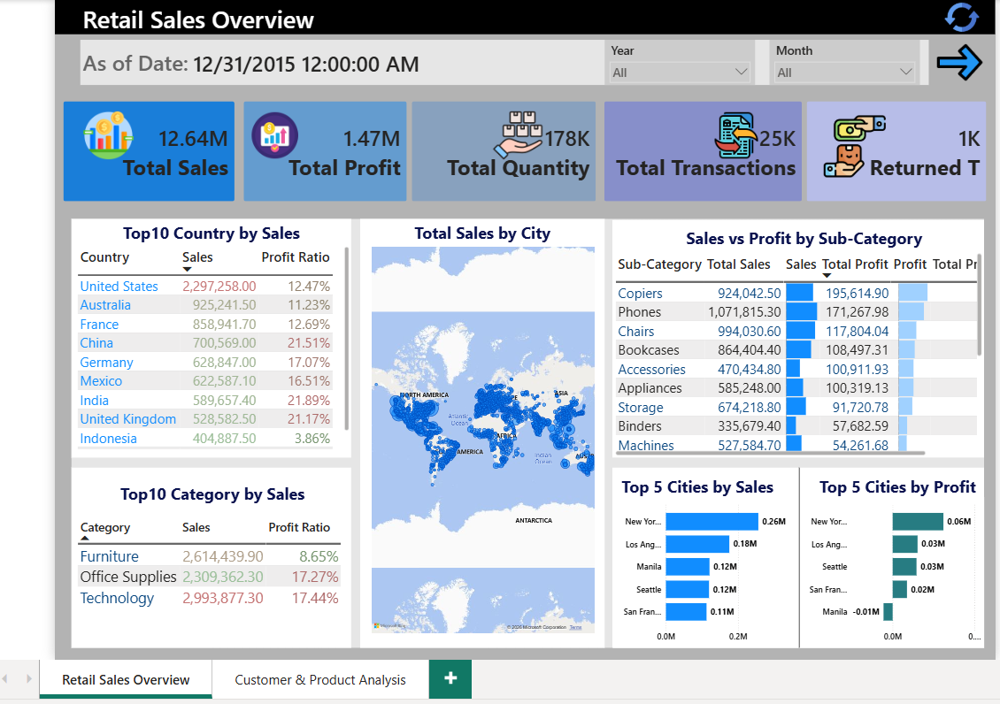
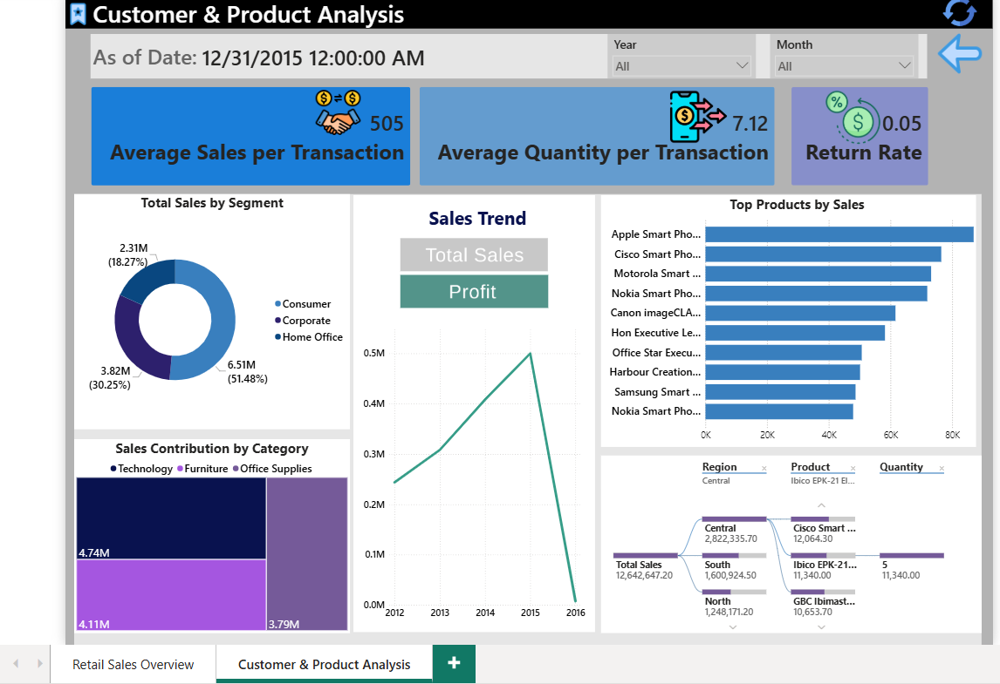

# Retail-Sales-Performance-Analysis-PowerBI
Interactive Power BI dashboard analyzing retail sales performance, customer behavior, product trends, profitability, and regional insights using data visualization and business intelligence techniques.

# 📊 Retail Sales Performance Analysis | Power BI Dashboard

An interactive **Power BI Retail Sales Analytics Dashboard** designed to analyze sales performance, customer segments, product profitability, regional distribution, and business trends.

This project transforms raw retail transaction data into meaningful business insights using data modeling, DAX calculations, and advanced Power BI visualizations.

---

# 📌 Project Overview

The dashboard provides a complete overview of retail business performance by analyzing:

* Total Sales Performance
* Profitability Analysis
* Customer Segmentation
* Product Performance
* Category Contribution
* Regional Sales Distribution
* Transaction Behavior
* Return Analysis

The project contains two interactive dashboard pages:

## 📄 Page 1 — Retail Sales Overview

### Key Insights:

* Total Sales: **12.64M**
* Total Profit: **1.47M**
* Total Quantity Sold: **178K**
* Total Transactions: **25K**
* Returned Transactions Analysis

### Visual Analysis:

* Top 10 Countries by Sales
* Sales Distribution by City
* Sales vs Profit by Sub-category
* Category Performance Comparison
* Top 5 Cities by Sales
* Top 5 Cities by Profit
* Global Sales Map

---

## 📄 Page 2 — Customer & Product Analysis

### Key Insights:

* Average Sales per Transaction
* Average Quantity per Transaction
* Return Rate Analysis

### Visual Analysis:

* Sales Contribution by Customer Segment
* Sales Trend Over Time
* Top Products by Sales
* Category Sales Contribution
* Customer/Product Breakdown Analysis

---

# 🔎 Analysis

## Business Questions Answered:

### Sales Performance

* How much revenue is generated?
* Which countries and cities contribute the most sales?
* How does sales performance change over time?

### Customer Analysis

* Which customer segments generate the highest revenue?
* What is the average transaction value?
* How frequently are products returned?

### Product Analysis

* Which products generate the highest sales?
* Which categories contribute the most revenue?
* Which sub-categories have better profitability?

### Regional Analysis

* Which locations perform best?
* Where are the strongest sales opportunities?

---

# 🗝 Key Concepts Used

## Power BI

* Data Cleaning & Transformation using Power Query
* Data Modeling
* Relationship Management
* Interactive Dashboard Design
* Drill-through Analysis
* Slicers and Filters
* Custom Visualizations

## DAX Measures

Created calculations for:

* Total Sales
* Total Profit
* Total Quantity
* Transaction Count
* Average Sales per Transaction
* Average Quantity per Transaction
* Return Rate
* Profit Ratio

## Data Visualization

Used:

* KPI Cards
* Line Charts
* Donut Charts
* Bar Charts
* Maps
* Tables
* Decomposition Tree
* Matrix Visuals

---

# 📈 Outputs

The final dashboard delivers:

✅ Executive sales overview
✅ Customer segmentation insights
✅ Product performance analysis
✅ Profitability tracking
✅ Regional sales comparison
✅ Return behavior analysis
✅ Interactive business reporting system

---

# 📝 Notes

* Dataset is used for educational and portfolio purposes.
* Dashboard focuses on business intelligence and data storytelling.
* All insights are generated from the provided retail transaction dataset.
* Power BI Desktop is required to open the `.pbix` file.

---

# 👤 About Me

⭐ If you find this project useful, feel free to star the repository!
